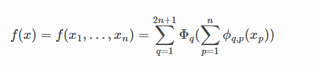

# KANs
Kolmogorov-Arnold representation theorem
Kolmogorov-Arnold representation theorem states that if 
 is a multivariate continuous function on a bounded domain, then it can be written as a finite composition of continuous functions of a single variable and the binary operation of addition

 

 